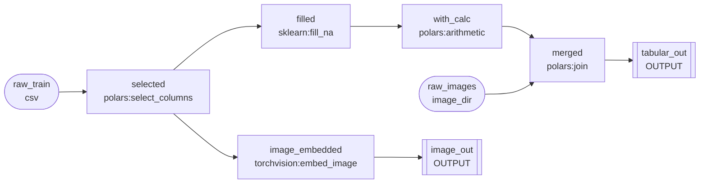

# 前処理パイプライン 実装計画

> ステータス: **承認待ち** — 内容を確認して問題なければ実装フェーズへ進みます

---

## 目的

学習用データの前処理パイプラインを実装する。
- どの変換を行うかをHydra Configで宣言的に指定できる
- 処理ライブラリ（Polars/Pandas等）をConfigで選択できる（Resolver pattern）
- 一部ステップが失敗・未対応でも、残りのステップは継続して実行される
- 将来的にTabular以外（Image / NLP / 推薦系）にも対応できる設計

---

## 1. DAG ベースのパイプライン設計

### 基本的な考え方

各処理ステップは **Node** として定義し、`from:` で接続することで DAG を形成する。

- `from:` を省略すると、直前に定義した Node の出力を自動的に使う（線形フローのショートハンド）
- `from:` にリストを渡すと複数 Node の出力をマージ（join/concat）できる
- `targets:` に実行したい末尾 Node の `id` を列挙すると、そこから逆向きに依存を解決し、必要な Node だけ実行する
- DAG を Mermaid 形式で可視化できる（`--visualize` フラグ）

### Node の種類

| 種別 | 書き方 | 説明 |
|------|--------|------|
| Input Node | `inputs:` に定義 | データソース（csv/parquet/glob/from_job） |
| Transform Node | `steps:` の各要素 | resolver:method による変換 |
| Output Node | `resolver: output` | 学習コードが読みに来る成果物を書き出す |

### Config イメージ（DAG）

```yaml
inputs:
  - id: raw_train
    path: data/raw/train.csv
    format: csv
  - id: raw_images
    glob: data/raw/images/**/*.png
    format: image_dir
    key_col: image_id

steps:
  # from: 省略 → 直前 Node（raw_train）を使う
  - id: selected
    polars:
      method: select_columns
      columns: [id, price, image_path, description, label]

  # from: 省略 → 直前 Node（selected）を使う
  - id: filled
    sklearn:
      method: fill_na
      strategy: median
      columns: [price]

  # filled から続く変換
  - id: with_calc
    polars:
      method: arithmetic
      operation: log1p
      col_a: price
      output_col: log_price

  # selected から分岐（filled とは別のブランチ）
  - id: image_embedded
    from: selected              # ← 明示的に分岐元を指定
    torchvision:
      method: embed_image
      column: image_path
      output_col: image_embed
      drop_source: true

  # 2 Node をマージ（join）
  - id: merged
    from: [with_calc, raw_images]
    polars:
      method: join
      on: id
      how: left

  # 出力 Node（tabular 特徴量）
  - id: tabular_out
    output:
      columns: [id, log_price, label, __weight__]
      format: parquet
      cv: true

  # 出力 Node（画像 embedding）
  - id: image_out
    from: image_embedded
    output:
      columns: [id, image_embed]
      format: parquet
      cv: false

targets:
  - tabular_out
  - image_out
```

### DAG の可視化

実行時に自動で `output_dir/{job_id}/{timestamp}/pipeline_dag.html` に保存される。
ブラウザで開くだけで DAG がレンダリングされる（追加ツール不要）。
`--visualize` フラグを付けると標準出力に Mermaid ソースも表示する。

```
uv run python -m src usecase=preprocess --visualize
```

保存先の例：
```
output_dir/
  my_preprocess/
    2026-03-15T120000/
      pipeline_dag.html       # ← ブラウザで開くだけで見れる（常に保存）
      preprocess_result.yaml  # ← マニフェスト（dag_path を記録）
      tabular_out/
        ...
```

`pipeline_dag.html` は Mermaid JS を inline 埋め込みするためオフライン環境でも動作する。
`preprocess_result.yaml` には `dag_path: pipeline_dag.html` として記録する。



### `targets` による部分実行

`targets: [tabular_out]` だけ指定すれば `image_embedded`, `image_out` は実行されない。
開発中に特定ブランチだけ動かしたいときに便利。

### Resolver登録の仕組み

```python
# src/infrastructure/preprocessor/registry.py
RESOLVER_REGISTRY: dict[str, type[StepResolver]] = {
    "polars": PolarsResolver,
    "pandas": PandasResolver,
    "sklearn": SklearnResolver,
}
```

`StepResolver` は Protocol で定義。各 Resolver は自分が持つメソッド一覧を `supported_methods()` で返す。

### エラーハンドリング方針

| 状況 | 挙動 |
|------|------|
| Resolverが存在しない | スキップ + metadata に `"status": "skipped", "reason": "resolver not found"` を記録 |
| Resolverにメソッドがない | スキップ + metadata に `"status": "skipped", "reason": "method not found in resolver"` を記録 |
| メソッドが存在するが実行中にエラー | スキップ + metadata に `"status": "failed", "reason": str(error)` を記録、後続ステップは継続 |

全ステップ完了後、`preprocess_result.yaml` にスキップ・失敗したステップの一覧が記録される。

---

## 2. マルチモーダル対応

### 基本的な考え方

`data_format` は pipeline 全体に一個ではなく、**各ステップが操作するカラムのモダリティ**を持つ設計にする。

中間データは常に **DataFrame（Polars）** として流れる。
画像・テキスト等は埋め込みベクトルに変換されてカラムとして追加される。
→ 最終出力は「モダリティ混在の Parquet」1ファイルにまとまる。

```
入力 DataFrame
 ├── price       (float)    ← polars で処理
 ├── category    (str)      ← polars で処理
 ├── image_path  (str)      ← torchvision で embed → image_embed (array) に変換
 └── description (str)      ← huggingface で embed → text_embed (array) に変換
                                         ↓
                              出力 DataFrame（Parquet）
                               ├── price
                               ├── category
                               ├── image_embed   (List[float])
                               └── text_embed    (List[float])
```

### Config イメージ（マルチモーダル）

各ステップに `column` / `columns` で操作対象カラムを明示する。

```yaml
steps:
  - polars:
      method: select_columns
      columns: [price, category, image_path, description, label]

  - sklearn:
      method: fill_na
      strategy: median
      columns: [price]

  - torchvision:                   # 将来対応
      method: embed_image
      column: image_path           # 入力: 画像パスのカラム
      output_col: image_embed      # 出力: 埋め込みベクトルのカラム
      model: resnet50
      drop_source: true            # image_path カラムを削除するか

  - huggingface:                   # 将来対応
      method: embed_text
      column: description
      output_col: text_embed
      model: sentence-transformers/all-MiniLM-L6-v2
      drop_source: true
```

### Resolver のモダリティ分類

| Resolver | モダリティ | 今回 |
|----------|-----------|------|
| `polars` | Tabular | 実装 |
| `sklearn` | Tabular | 実装 |
| `torchvision` | Image | 将来 |
| `albumentations` | Image（augmentation）| 将来 |
| `huggingface` | Text / Image / Audio | 将来 |
| `spacy` | Text | 将来 |
| `implicit` | 推薦（user-item） | 将来 |

未実装 Resolver は graceful skip（`resolver not found`）で継続。

### PreprocessResult

`data_format` は出力カラムの内訳を持つ形に変更。

```python
@dataclass
class ColumnMeta:
    name: str
    modality: str       # "tabular" / "image_embed" / "text_embed" / "sequence"
    dtype: str          # "float32" / "int64" / "List[float32]" など

@dataclass
class PreprocessResult:
    output_path: Path
    columns: list[ColumnMeta]   # 出力カラムのモダリティ一覧
    n_rows: int | None
    n_splits: int | None        # CV使用時
    step_results: list[StepResult]
    commit_hash: str
    seed: int
```

```python
@dataclass
class StepResult:
    resolver: str
    method: str
    status: str               # "ok" / "skipped" / "failed"
    reason: str | None
```

---

## 3. CV対応（データリーク防止）

### 設計

```yaml
cv:
  strategy: time_series     # or kfold / stratified_kfold / none
  n_splits: 5
  time_col: date            # time_series の場合のみ
  target_col: target        # stratified_kfold の場合のみ
```

- `fit` は必ずTrainデータのみで行う
- `transform` をTestデータに適用（`fill_na` のmedian統計量など）
- `strategy: none` のときは全データを単一のsplitとして処理

### CV の適用範囲

CV は `output` ステップごとに `cv` フラグで制御する。
embedding など split 不要なものはジョブレベルの CV 設定に縛られない。

```yaml
steps:
  - output:
      id: tabular_features
      columns: [id, price, label]
      format: parquet
      cv: true              # ← fold_N/train・test に分割して保存

  - output:
      id: image_embeddings
      columns: [id, image_embed]
      format: parquet
      cv: false             # ← CV 不要、単一ファイルで保存
```

`cv` を省略した場合はジョブレベルの `cv.strategy` に従う。

---

## 4. データパス設計

### 課題

- ファイルが1つとは限らない（`*_01.csv`, `*_02.csv`, `**/*.png`, `**/*.txt` など）
- モダリティが混在する入力（CSV 1本 + 大量の `*.txt`）
- 前のジョブの出力を入力として使いたい（チェーン）
- ある中間状態から処理を分岐させたい（ブランチ）

### `inputs` の構造

`input_path: ???` 単体を廃止し、**名前付き入力ソース**のリストに変更する。

```yaml
inputs:
  - id: main           # ← このジョブ内での参照名
    path: data/raw/train.csv
    format: csv        # csv / parquet / jsonl

  - id: supplement
    glob: data/raw/extra_*.csv    # ← glob で複数ファイルを連結
    format: csv

  - id: texts
    glob: data/raw/texts/**/*.txt # ← *.txt を大量に読む
    format: text_dir
    key_col: user_id              # ← main との join キー（ファイル名 or カラム）

  - id: images
    glob: data/raw/images/**/*.png
    format: image_dir
    key_col: image_id
```

| フィールド | 説明 |
|-----------|------|
| `path` | 単一ファイル |
| `glob` | パターンマッチ（CSV は concat、image/text_dir はディレクトリスキャン） |
| `format` | `csv` / `parquet` / `jsonl` / `image_dir` / `text_dir` |
| `key_col` | main テーブルとの join キー（`image_dir` / `text_dir` のみ必須） |

### 別ジョブの Output Node を Input として使う

`from_job` + `output_id` で別ジョブの Output Node を Input Node として参照できる。

```yaml
# ジョブ A（ベース前処理）
job_id: base_features
inputs:
  - id: raw_train
    path: data/raw/train.csv
steps:
  - id: filled
    sklearn:
      method: fill_na
      strategy: median
  - id: tabular_out
    output:
      columns: [id, price, label]
      format: parquet
targets: [tabular_out]

# ジョブ B（ジョブ A の tabular_out を起点に追加処理）
job_id: extended_features
inputs:
  - id: base             # ← 別ジョブの Output Node を Input Node として参照
    from_job: base_features
    output_id: tabular_out
  - id: supplement
    path: data/external/new.csv
steps:
  - id: joined
    from: [base, supplement]
    polars:
      method: join
      on: id
      how: left
  - id: extended_out
    output:
      columns: [id, price, extra_col, label]
      format: parquet
targets: [extended_out]
```

`from_job` を使うと `preprocess_result.yaml` に依存関係が記録され、
学習ジョブ側でどの前処理チェーンを経たかを完全にトレースできる。

### `checkpoint` と `output` の違い

| ステップ | 目的 | 学習コードから直接参照 |
|---------|------|----------------------|
| `checkpoint` | 分岐起点のための中間保存 | しない（内部用） |
| `output` | 学習コードが読みに来る成果物 | する |

**`output` ステップを明示的に書かない限り、ファイルは生成されない。**
パイプラインの「最後の状態」が自動で出力されるような暗黙の挙動はない。

### `output` ステップの書き方

```yaml
steps:
  # ...変換処理...

  # tabular 特徴量だけ出力（embedding は含めない）
  - output:
      id: tabular_features
      columns: [id, price, category, label, __weight__]
      format: parquet               # parquet / csv / jsonl / npy

  # 画像 embedding だけ別ファイルで出力
  - output:
      id: image_embeddings
      columns: [id, image_embed]
      format: parquet

  # テキスト embedding も別ファイルで出力
  - output:
      id: text_embeddings
      columns: [id, text_embed]
      format: parquet
```

学習コードは `preprocess_result.yaml` を見て何が使えるかを把握し、
**join / concat は学習側の責務**とする。

### マニフェスト（preprocess_result.yaml）

```yaml
job_id: my_preprocess
timestamp: "2026-03-15T12:00:00"
commit_hash: "abc1234"
executor_used: local
executor_fallback: true           # フォールバックした場合のみ
executor_requested: gcp_vertex

depends_on:
  - job_id: shared_base
    checkpoint: after_select

outputs:                          # output ステップで生成されたファイル一覧
  - id: tabular_features
    path: tabular_features/        # CV あり → ディレクトリ
    format: parquet
    columns: [id, price, category, label, __weight__]
    modalities: [tabular]
    cv_splits: 5
  - id: image_embeddings
    path: image_embeddings.parquet # CV なし → 単一ファイル
    format: parquet
    columns: [id, image_embed]
    modalities: [image_embed]
    cv_splits: null

step_results:
  - resolver: polars
    method: select_columns
    status: ok
  - resolver: torchvision
    method: embed_image
    status: skipped
    reason: "resolver not found"
```

### 出力ディレクトリ構造

```
output_dir/
  {job_id}/
    {timestamp}/
      preprocess_result.yaml      # マニフェスト（学習コードの入口）
      tabular_features/           # output id=tabular_features（CV あり）
        fold_0/
          train.parquet
          test.parquet
        fold_1/
          train.parquet
          test.parquet
      image_embeddings.parquet    # output id=image_embeddings（CV なし）
      text_embeddings.parquet     # output id=text_embeddings（CV なし）
      .checkpoints/               # checkpoint ステップの保存先（内部用）
        after_select.parquet
```

CV の適用範囲も `output` ステップごとに制御できる（embedding は CV 不要が多い）。

---

## 5. Config の全体像

```yaml
# conf/usecase/preprocess.yaml
# @package _global_
usecase: preprocess

job_id: my_preprocess         # ← 省略時は timestamp 自動生成

inputs:
  - id: main
    path: ???                 # 必須

output_dir: data/processed

executor:
  type: local                 # local / ray_local / ray_remote / gcp_vertex / gcp_dataflow / aws_sagemaker / aws_emr

cv:
  strategy: none              # none / time_series / kfold / stratified_kfold
  n_splits: 5
  time_col: null
  target_col: null

steps: []                     # リスト形式（下記サンプル参照）

seed: 42
```

```yaml
# conf/preprocessor/tabular_example.yaml
# ユーザーがコピーして使うサンプル設定

inputs:
  - id: main
    path: data/raw/train.csv
  - id: supplement
    glob: data/raw/extra_*.csv
    format: csv

steps:
  - polars:
      method: join              # 複数入力を結合
      left: main
      right: supplement
      on: id
      how: left

  - polars:
      method: select_columns
      columns: [id, col1, col2, col3, label]

  - sklearn:
      method: fill_na
      strategy: median
      columns: [col1, col2]

  - polars:
      method: arithmetic
      operation: multiply
      col_a: col1
      col_b: col2
      output_col: col1_x_col2

  - polars:
      method: exp_weight
      time_col: date
      decay: 0.95
      weight_col: __weight__
```

---

## 5. 実行環境（Executor）の抽象化

前処理は将来的にローカル以外で実行したいケースが出てくる。
実行環境もConfigで切り替えられる設計にしておく。

### Executor の種類

| executor | 説明 | 代表的な用途 |
|----------|------|-------------|
| `local` | ローカルプロセスで逐次実行（デフォルト） | 開発・小規模データ |
| `ray_local` | Ray をローカルで起動、並列実行 | 中規模データ、CPUコア活用 |
| `ray_remote` | Ray クラスタに接続して実行 | 大規模データ、スケールアウト |
| `gcp_dataflow` | GCP Dataflow（Apache Beam）で実行 | ストリーム・大規模バッチ |
| `gcp_vertex` | Vertex AI Custom Job として実行 | GPU/TPU を使いたい前処理 |
| `aws_emr` | AWS EMR（Spark）で実行 | 既存Sparkパイプラインとの統合 |
| `aws_sagemaker` | SageMaker Processing Job として実行 | AWS環境での前処理標準化 |

### 設計方針

```
PreprocessUseCase
    └── ExecutorFactory.build(cfg.executor)
            └── Executor Protocol
                    ├── LocalExecutor        # subprocess/スレッド
                    ├── RayExecutor          # ray.remote
                    ├── DataflowExecutor     # apache-beam
                    ├── VertexExecutor       # google-cloud-aiplatform
                    ├── EmrExecutor          # boto3 + pyspark
                    └── SageMakerExecutor    # boto3 sagemaker
```

`Executor` は Protocol で定義。`PreprocessUseCase` は Executor の存在を知らず、`run(steps, data)` を呼ぶだけ。

### Config の全体像（executor追加版）

```yaml
# conf/usecase/preprocess.yaml
# @package _global_
usecase: preprocess
data_format: tabular

input_path: ???
output_dir: data/processed

executor:
  type: local               # local / ray_local / ray_remote / gcp_dataflow / gcp_vertex / aws_emr / aws_sagemaker

cv:
  strategy: none
  n_splits: 5
  time_col: null
  target_col: null

steps: []

seed: 42
```

各 executor 固有の設定は `conf/executor/` に分離する（usecase config は executor の詳細を知らない）。

```yaml
# conf/executor/ray_local.yaml
type: ray_local
num_cpus: 4               # Ray に渡すリソース設定
num_gpus: 0

# conf/executor/ray_remote.yaml
type: ray_remote
address: ray://my-cluster:10001
num_cpus: 16
num_gpus: 2

# conf/executor/gcp_vertex.yaml
type: gcp_vertex
project: my-gcp-project
region: asia-northeast1
machine_type: n1-standard-8
container_uri: gcr.io/my-project/preprocess:latest
staging_bucket: gs://my-bucket/staging

# conf/executor/gcp_dataflow.yaml
type: gcp_dataflow
project: my-gcp-project
region: asia-northeast1
temp_location: gs://my-bucket/temp
runner: DataflowRunner

# conf/executor/aws_sagemaker.yaml
type: aws_sagemaker
role_arn: arn:aws:iam::123456789:role/SageMakerRole
instance_type: ml.m5.xlarge
instance_count: 1
base_job_name: preprocess

# conf/executor/aws_emr.yaml
type: aws_emr
cluster_id: j-XXXXXXXXXX
region: ap-northeast-1
```

### エラーハンドリング方針（executor不在時）

Resolverと同様に、未実装のExecutorが指定された場合もエラーで落とさない。

| 状況 | 挙動 |
|------|------|
| Executorが未実装 | `local` にフォールバック + `PreprocessResult` に `"executor_fallback": true` を記録 |
| 接続失敗（Ray/GCP/AWS） | フォールバック + ログ出力、`preprocess_result.yaml` にエラー詳細を記録 |

---

## 6. ディレクトリ構造

```
src/
  domain/
    data/
      preprocessor.py         # PreprocessResult, StepResult, Preprocessor Protocol
    executor/
      executor.py             # Executor Protocol
  usecase/
    preprocessing/
      preprocess.py           # PreprocessUseCase
  infrastructure/
    preprocessor/
      __init__.py
      registry.py             # RESOLVER_REGISTRY
      resolvers/
        __init__.py
        base.py               # StepResolver Protocol
        polars_resolver.py    # PolarsResolver
        sklearn_resolver.py   # SklearnResolver
      tabular.py              # TabularPreprocessor (Preprocessor Protocol実装)
    executor/
      __init__.py
      factory.py              # ExecutorFactory.build(cfg)
      local.py                # LocalExecutor（デフォルト）
      ray_executor.py         # RayExecutor（将来）
      gcp_vertex.py           # VertexExecutor（将来）
      gcp_dataflow.py         # DataflowExecutor（将来）
      aws_sagemaker.py        # SageMakerExecutor（将来）
      aws_emr.py              # EmrExecutor（将来）

conf/
  usecase/
    preprocess.yaml           # executor.type: local がデフォルト
  preprocessor/
    tabular_example.yaml
  executor/
    local.yaml
    ray_local.yaml
    ray_remote.yaml
    gcp_vertex.yaml
    gcp_dataflow.yaml
    aws_sagemaker.yaml
    aws_emr.yaml

tests/
  domain/data/
    test_preprocessor.py
  domain/executor/
    test_executor.py
  usecase/preprocessing/
    test_preprocess.py
  infrastructure/preprocessor/
    test_registry.py
    resolvers/
      test_polars_resolver.py
      test_sklearn_resolver.py
    test_tabular.py
  infrastructure/executor/
    test_factory.py           # 未実装executor → localフォールバックのテスト
    test_local.py

docs/
  manual/
    preprocess.md
```

---

## 6. スコープ（今回 vs 将来）

### 今回実装するもの
- [x] `polars` Resolver: `select_columns`, `arithmetic`, `exp_weight`
- [x] `sklearn` Resolver: `fill_na`
- [x] Registry パターン（resolver not found / method not found の graceful skip）
- [x] エラー時継続（step失敗でもパイプライン継続）
- [x] CV: `time_series`, `kfold`, `none`
- [x] Tabular出力（Parquet）
- [x] `PreprocessResult` / `StepResult` のmetainfo保存

### 将来に先送り
- [ ] `pandas` Resolver（今回は `polars` + `sklearn` のみ）
- [ ] Image / NLP / 推薦系 Resolver
- [ ] Hydraのconfig group切り替えによる `data_format` 自動選択
- [ ] rolling統計（`polars:rolling_stats`）

---

## 8. スコープ（今回 vs 将来）

### 今回実装するもの
- [x] `polars` Resolver: `select_columns`, `arithmetic`, `exp_weight`
- [x] `sklearn` Resolver: `fill_na`
- [x] Registry パターン（resolver not found / method not found の graceful skip）
- [x] エラー時継続（step失敗でもパイプライン継続）
- [x] CV: `time_series`, `kfold`, `none`
- [x] Tabular出力（Parquet）
- [x] `PreprocessResult` / `StepResult` のmetainfo保存
- [x] `LocalExecutor` のみ実装、他は Config のみ定義してフォールバック対応

### 将来に先送り
- [ ] `RayExecutor`, `VertexExecutor`, `DataflowExecutor`, `SageMakerExecutor`, `EmrExecutor` の実装
- [ ] `pandas` Resolver
- [ ] Image / NLP / 推薦系 Resolver / Executor
- [ ] rolling統計（`polars:rolling_stats`）
- [ ] `stratified_kfold`

---

## 9. 決定事項（解決済み）

| # | 項目 | 決定内容 |
|---|------|---------|
| 1 | デフォルト Resolver | `polars` を採用 |
| 2 | `exp_weight` の出力 | 重みカラム（`__weight__`）として Parquet に出力し、学習時に `sample_weight` で渡す |
| 3 | Executor フォールバック | 未実装 Executor は `local` に自動フォールバック。`preprocess_result.yaml` に `executor_fallback: true` と理由を記録 |
| 4 | 入力形式 | `format` フィールドで指定（`csv` / `parquet` / `jsonl` / `image_dir` / `text_dir`）。将来の拡張に備えて Reader も Registry 化 |

---

## 変更履歴

| 日付 | 変更内容 |
|------|---------|
| 2026-03-15 | 初版作成 |
| 2026-03-15 | マルチモーダル対応、データパス設計、Executor 抽象化を追加 |
| 2026-03-15 | 未決事項を全て解決・確定 → ステータス：**承認待ち** |
